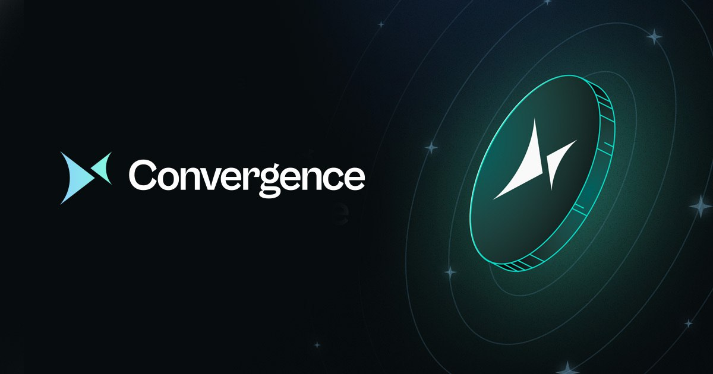

# Welcome

<figure><figcaption></figcaption></figure>


A request for quote (RFQ) network is an important type of exchange differentiated from a continuous limit order book (CLOB) or automated market makers (AMM). It is a fundamental financial primitive allowing takers to invite makers to submit price quotes to fill orders.


Convergence RFQ is an infrastructure product for trading systems. Designed to be fully on-chain and highly capital efficient, our RFQ system offers multi-leg buy, sell, and two-way quoting for multi-leg structures including spot and options contracts with a flexible architecture for adding additional instruments such as futures or other delta one derivatives. With our RFQ system, traders can easily access and transact with a wide range of counterparties, increasing their flexibility and potential profitability. Our under-collateralized approach also means that traders can conserve capital while still taking advantage of a diverse range of trading opportunities. Whether you are a professional trader or a financial institution, our RFQ infrastructure product is the ideal solution for optimizing your trading strategies and maximizing your returns.

### Community


[community.md](community.md)


### Protocol

Learn about Convergence RFQ, read up on architecture, and check the FAQ to get started as quickly as possible.


[overview.md](protocol/overview.md)



[architecture](protocol/architecture/)



[faq.md](protocol/faq.md)


### Use Cases

Read about our market making use cases.


[makers.md](use-cases/makers.md)


### Guides

A visual guide for working with RFQs using our UI.


[setup-collateral-account.md](guides/setup-collateral-account.md)



[create-an-rfq.md](guides/create-an-rfq.md)



[respond-to-an-rfq.md](guides/respond-to-an-rfq.md)



[settle-an-rfq.md](guides/settle-an-rfq.md)


### Developers

Useful information and resources for developers.


[program-deployments.md](developers/program-deployments.md)



[typescript-sdk.md](developers/typescript-sdk.md)



[cli.md](developers/cli.md)



[rest-api](developers/rest-api/)



[psyoptions-integration-example.md](developers/psyoptions-integration-example.md)

