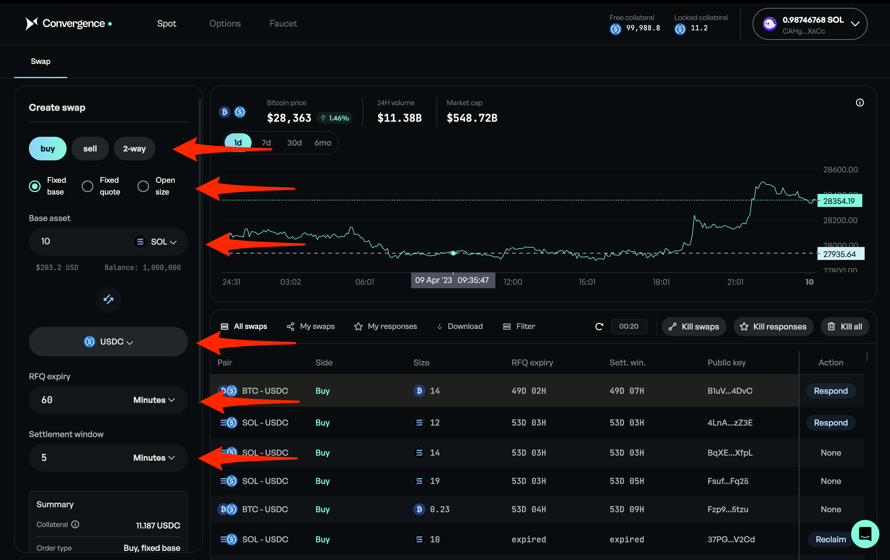
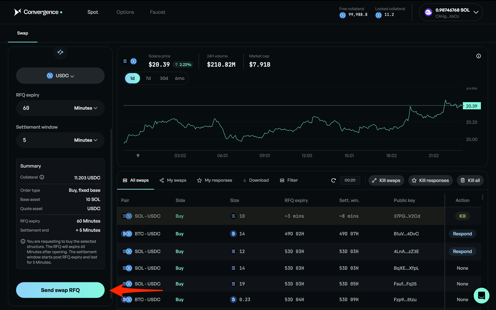
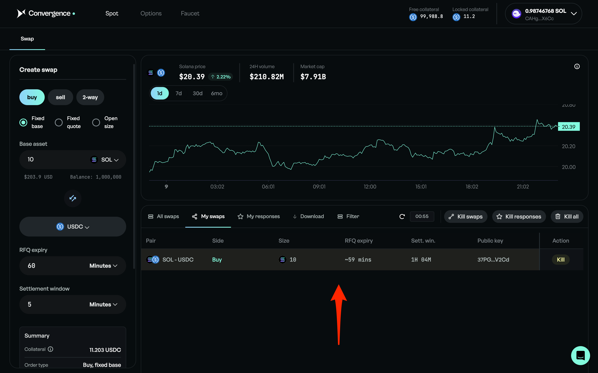

# Create an RFQ

## Step 1: RFQ Selections

<figure><figcaption>
Select "buy", "sell" or "2-way", then "Fixed base", "Fixed quote" or "Open size", then "Base asset" and quote asset, "RFQ. expiry" and "Settlement window"
</figcaption></figure>

## Step 2: Create the RFQ

<figure><figcaption>
Click "Send swap RFQ"
</figcaption></figure>

<figure><figcaption>
Your RFQ can now be seen in "My swaps"
</figcaption></figure>
