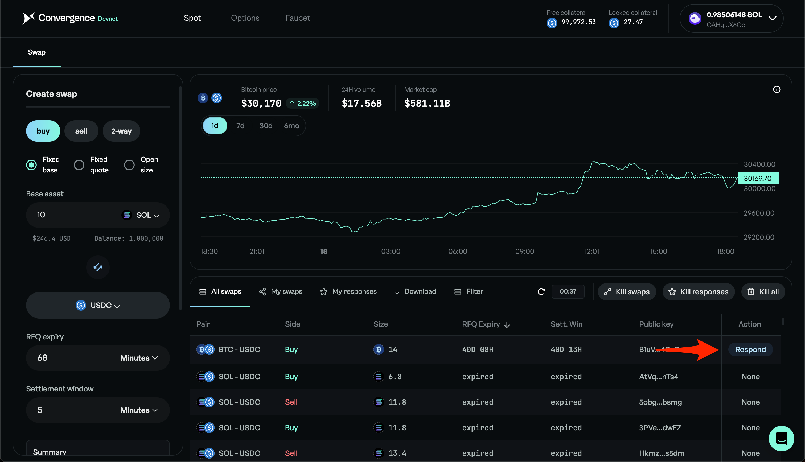
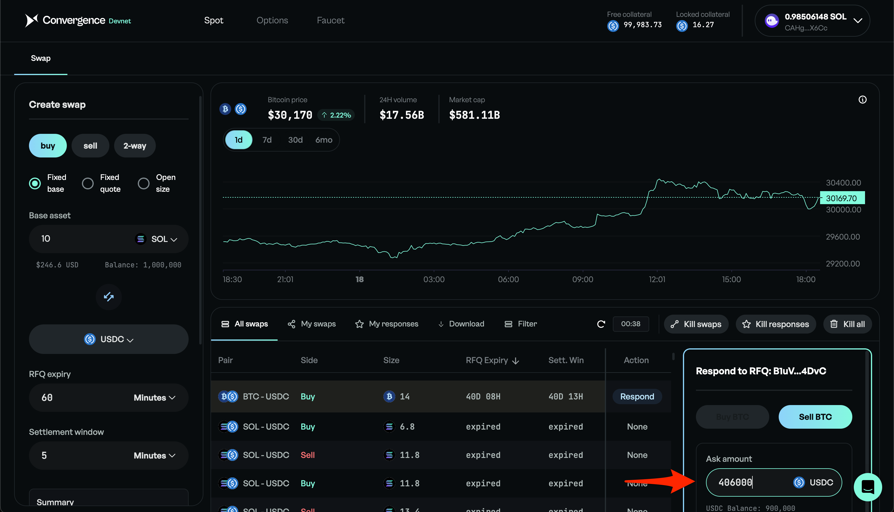
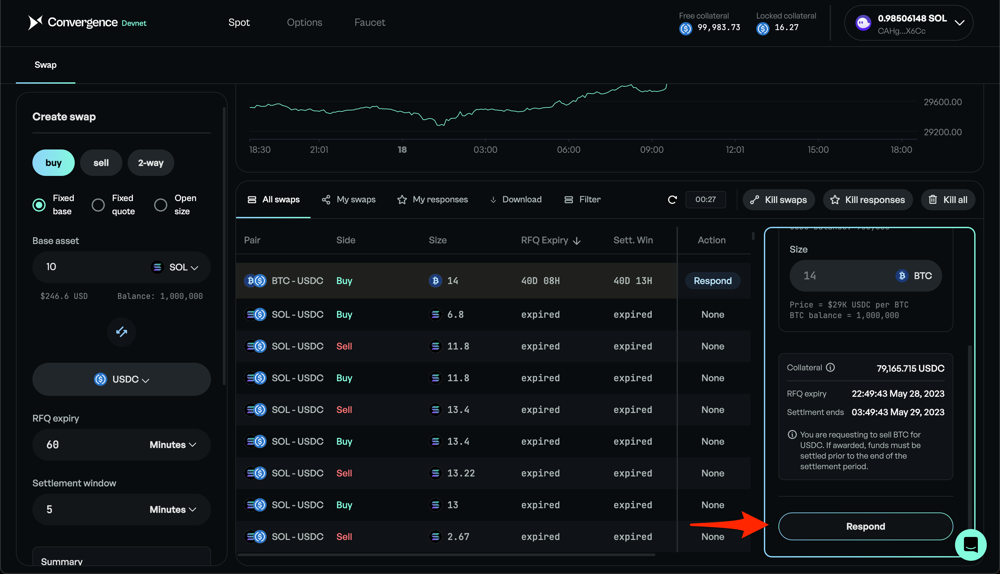
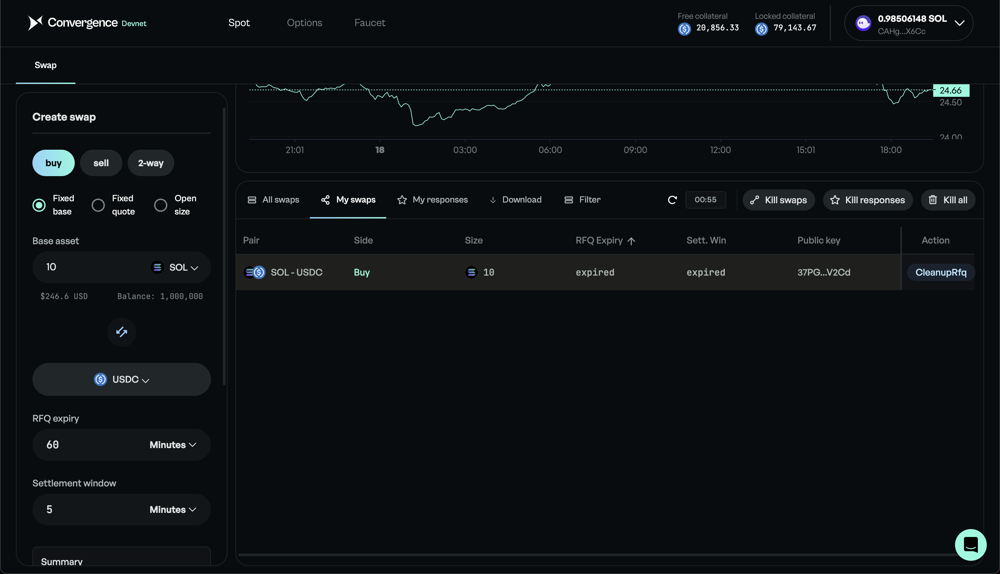

# Respond to an RFQ

## Step 1: Select RFQ

<figure><figcaption>
Click "Respond"
</figcaption></figure>

## Step 2: Enter Amount

<figure><figcaption>
Enter amount
</figcaption></figure>

## Step 3: Submit

<figure><figcaption>
Click "Respond"
</figcaption></figure>

## Step 4: View Swap

<figure><figcaption></figcaption></figure>
