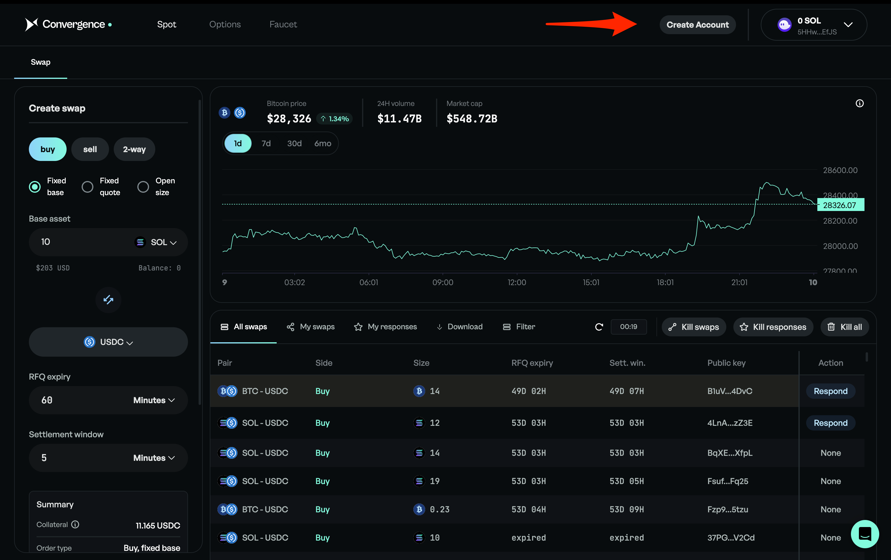
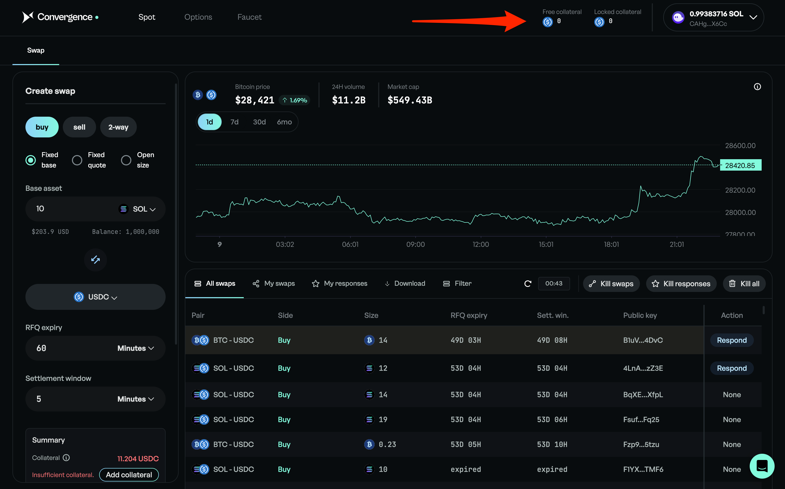
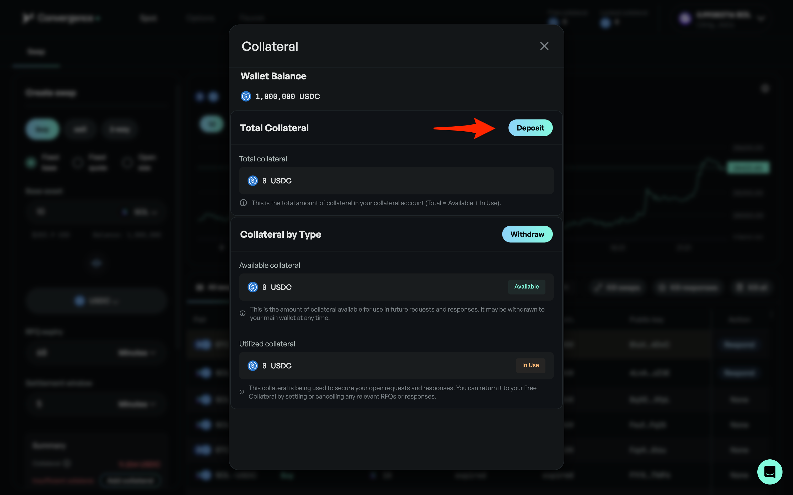
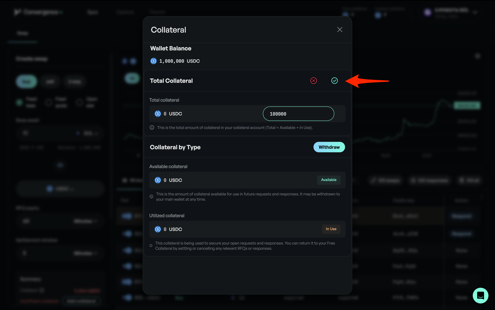
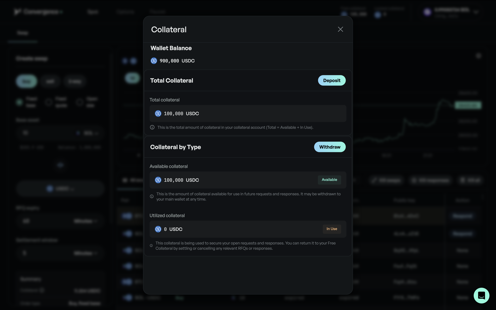

# Setup Collateral Account

## Step 1: Create a Collateral Account

<figure><figcaption>
Click "Create Account"
</figcaption></figure>

## Step 2: Fund Collateral Account

<figure><figcaption>
Click either "Free Collateral" or "Locked Collateral"
</figcaption></figure>

<figure><figcaption>
Click "Deposit"
</figcaption></figure>

<figure><figcaption>
Enter amount and click the green check button
</figcaption></figure>

<figure><figcaption>
Your collateral is now deposited
</figcaption></figure>

